# Universocial

## 프로젝트 개요
코로나로 인해 강의가 비대면으로 시행하게 되면서 수업을 이해하는데에 어려움을 겪는 학생들이 늘어나게 되었습니다. 
또한 학생들이 수업을 듣는 시간이 자유로워져 교수님들에게 질문을 하게 되어도 빠른 답변을 받기 힘들었습니다. 
이러한 문제를 해결하고자 정보의 장이 되어줄 사이트를 기획하게 되었습니다. 
팀원은 총 3명으로 저는 UI/UX 디자인을 담당하며, 사용자의 로그인과 관련된 기능 및 각 팀원에게 분배된 업무를 받아 
병합하는 역할을 하였습니다.

## 기술 스택
* Java
* JSP
* HTML
* CSS
* Javascript

## 담당 영역
- 프로젝트의 UI/UX 디자인 설계 및 구현
- 회원가입, 로그인 기능 구현 및 로그인 유저인 경우 게시글, 댓글, 메신저 기능이 사용 가능하게 세션 관리
- 관리자 페이지를 제작하여 각 회원의 정보를 조회 및 변경 삭제 할 수 있는 기능을 구현하였습니다.
관리자 페이지는 회원을 탈퇴시키거나 정보를 변경하는 경우, 다른 페이지에도 영향을 주게 되어 파악하는데에 어려움을 겪었으며,
이는 테이블 외래키를 설정하고 팀원들의 코드를 병합하면서 구조를 파악하여 해결할 수 있었습니다. 

## 구현 내용
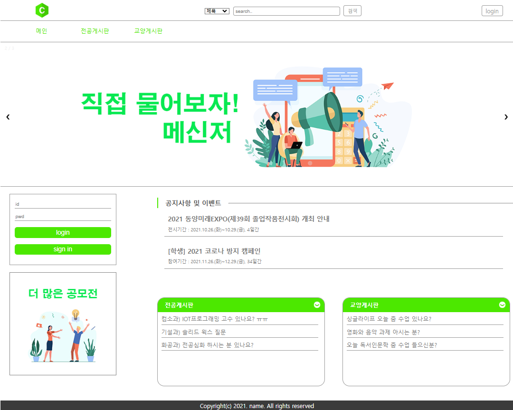 
메인페이지로, 로그인 기능과 게시판 내용 및 공지사항 등을 확인할 수 있습니다.  
상단에 헤더를 통해 게시글 검색, 로그인 페이지 이동이 가능합니다.  

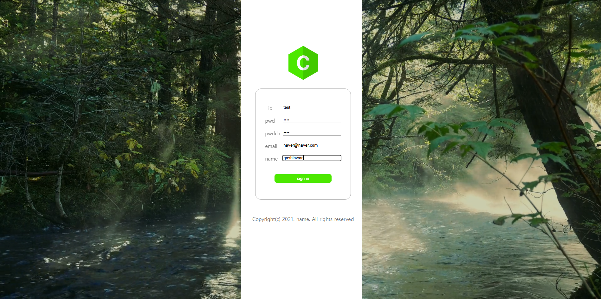 
회원가입 페이지로 정보를 기입하면 가입할 수 있습니다. 이때 이메일 양식에 맞게 입력을 안하거나 입력란 공백, 
아이디 중복 시 회원가입은 불가능합니다.  

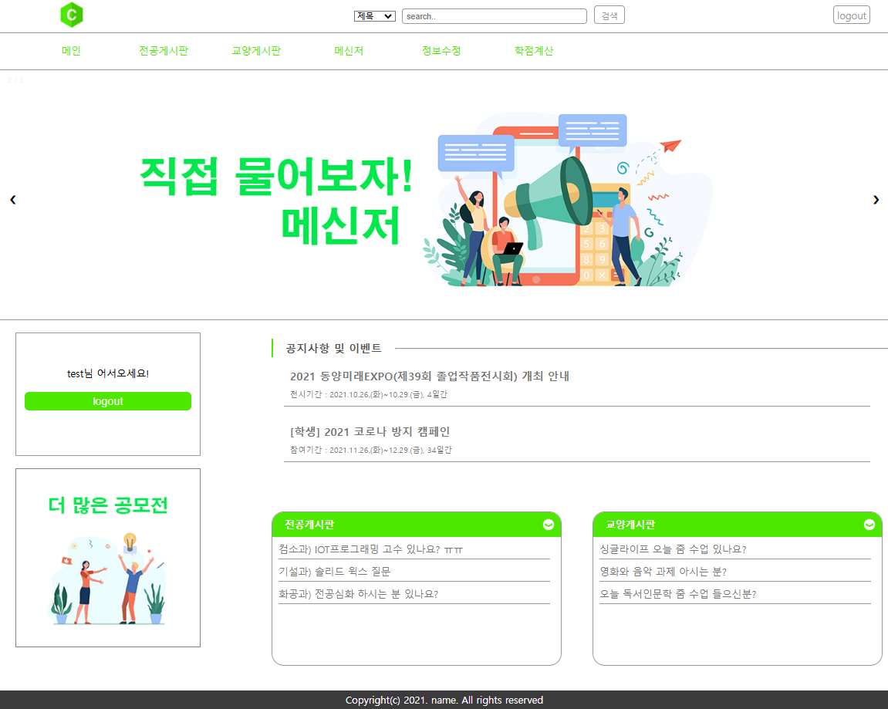 
로그인 후 메인페이지에 접속하면 로그인 폼과 헤더에 로그인 버튼은 로그아웃 버튼으로 바뀌게 됩니다.  

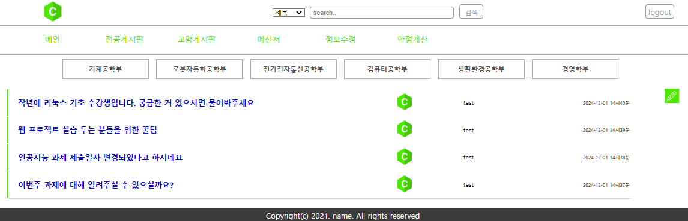 
게시판으로 게시글 제목을 클릭하면 해당 게시글로 이동하며, 목록에서 작성자와 작성일자를 확인할 수 있습니다.  

|다른사람|본인|
|---|---|
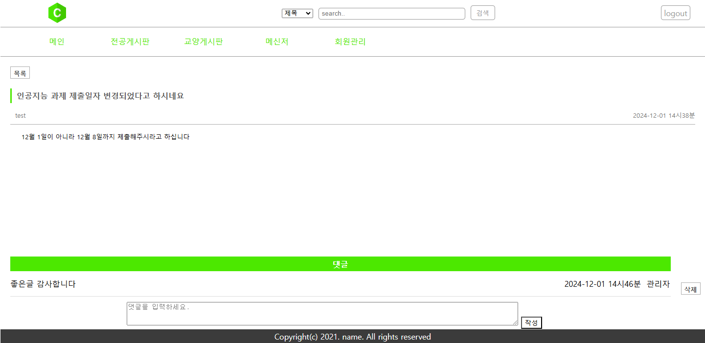|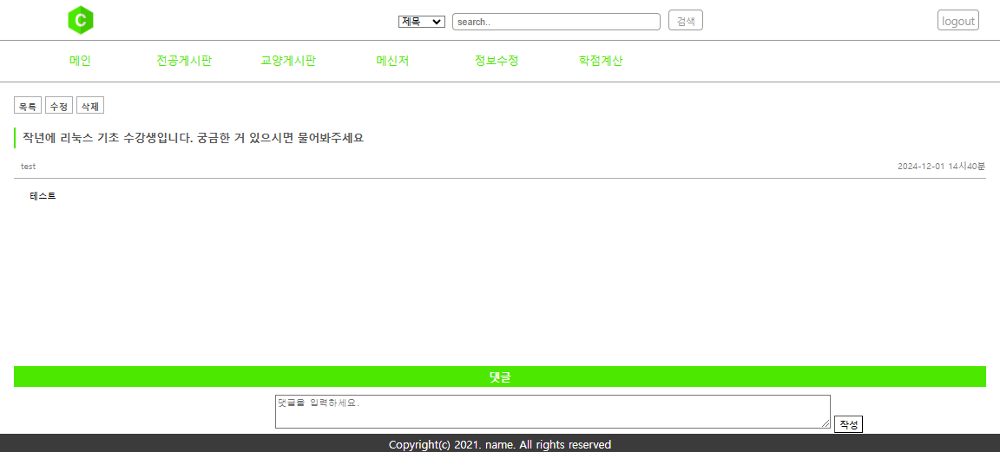 

|수정|삭제|
|---|---|
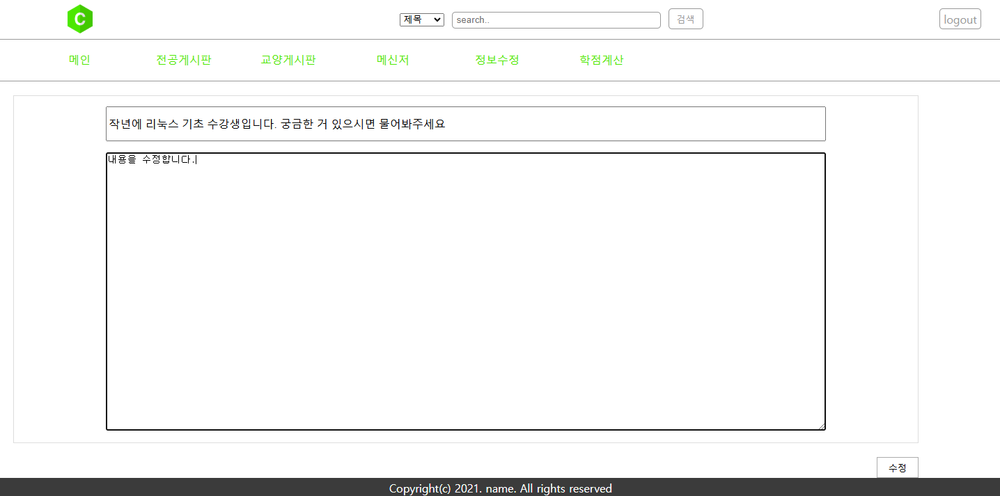|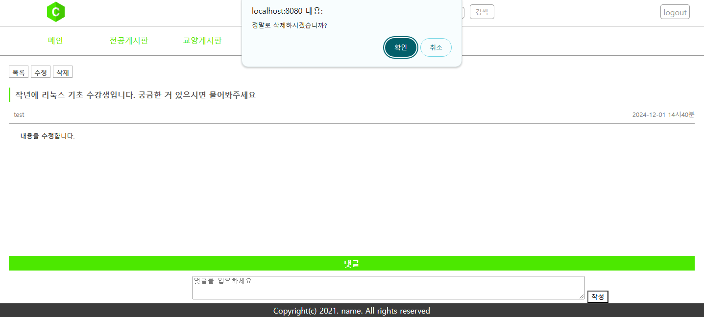 

게시글에서는 게시글 내용 확인 할 수 있으며 하단에 댓글란을 통해 댓글을 작성할 수 있으며 본인 댓글일 경우 
삭제할 수 있습니다. 게시글 삭제 수정 또한 본인의 게시글일 경우 버튼이 활성화 됩니다.  

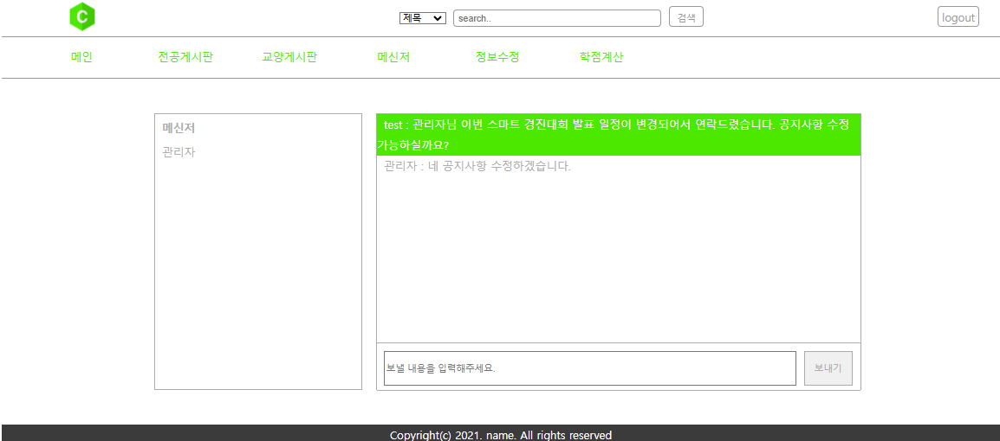 
메신저 기능은 사이트 내에 유저들에게 쪽지를 보내는 기능으로 옆에 목록에서 원하는 유저를 선택한 뒤 보내기 버튼을 누르면 전달됩니다.  

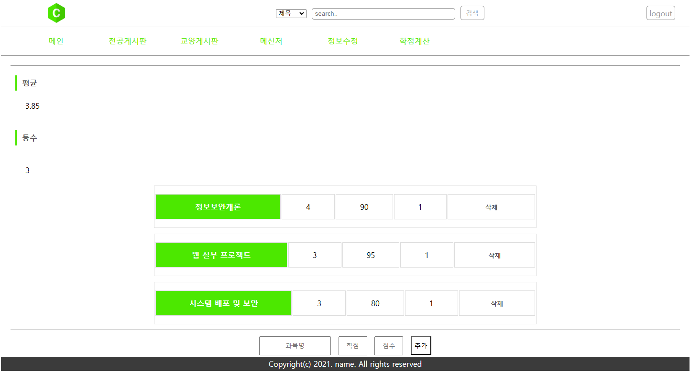 
학점 계산 기능으로 자신이 수강한 과목과 학점을 입력하여 계산할 수 있습니다.  

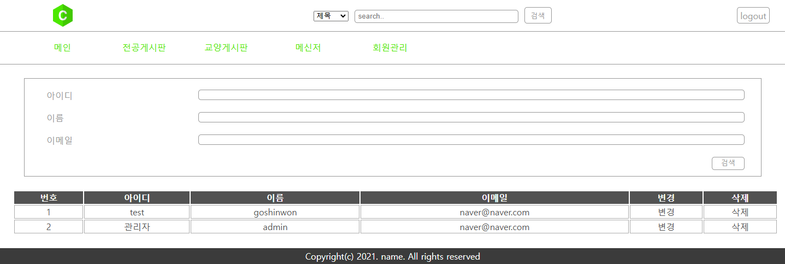 
관리자 페이지는 관리자 계정으로 로그인하면 상단에 학점 계산 대신 회원관리 메뉴가 활성화되어 
접속할 수 있습니다. 아이디, 이름, 이메일을 통해 특정 유저를 검색할 수 있으며, 유저들의 정보를 변경하거나 탈퇴처리할 수 있습니다. 
